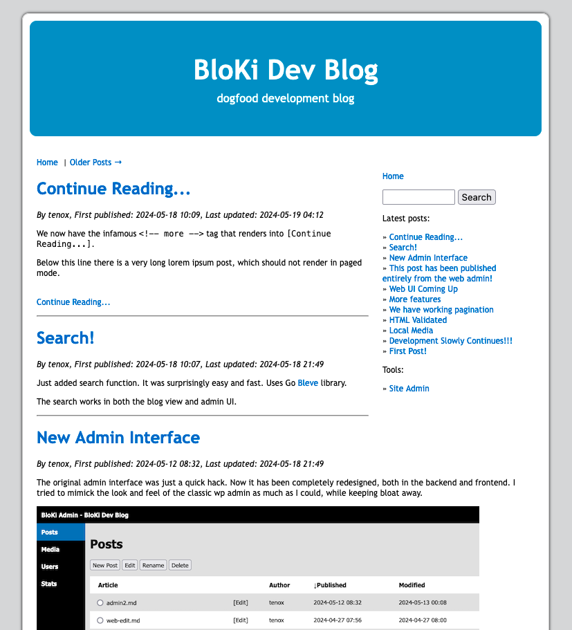
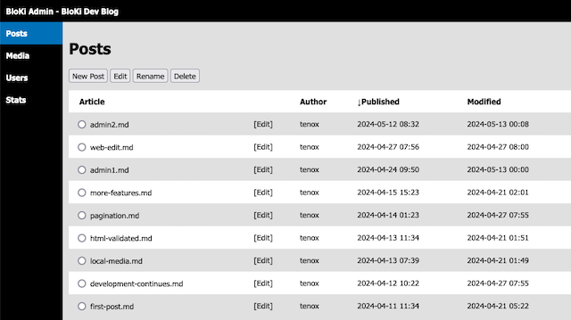

# BloKi - A minimalistic Blog and Wiki Engine

If you are looking for a small, simple, easy to use,  micro blog/wiki platform that looks like WordPress / MediaWiki, but loathe the bloat of the LAMP stack, this might be just for you.

## Main features

- No PHP, Apache, Nginx, JavaScript, Java, SQL and any other cruft.

- The themes and web based Admin UI resembles WordPress and MediaWiki, but without all the baggage.

- Articles and media are stored as regular files. Apart from web admin - editable in any editor of your choice! Versioned by Git.

- The server software is a single file, statically linked, self contained binary. Runs on most modern OSes without any external dependencies, scripting runtimes, libraries, etc. Easily host your blog on a Raspberry PI, small VM, Docker container, Lambda or Cloud Run function.

- BloKi supports all the modern web browsers, as well as lower end, older, legacy, vintage and even text mode.



## Current status

- Basic blog engine and admin UI works.
- Search, pagination, markdown, images, etc.
- You can see a working example on [dogfood blog](https://blog.tenox.net/)

## Running BloKi

To try BloKi, download a binary from the [releases page](https://github.com/tenox7/BloKi/releases). Run
it like so:

```sh
chmod 755 bloki
./bloki
```

A sample starting post will be created, which you can edit using any editor of your choice.

### Web Admin

BloKi web admin is available under `/bk-admin/` url, defined by `-admin_uri` flag. In order to log in for the first time, a user will need to be created from command line. You can use the `user` command to list, delete users and set passwords. To create a user, simply set their password. The secrets file is required for this. Example:

```sh
bloki -secrets /path/to/bloki.secrets  user  passwd  admin
New Password: ...
```

Currently there is no 2FA so please use a [strong password](https://xkcd.com/936/).

### Site Directory

By default BloKi looks for `./site` in the current directory. You can specify your own site folder
with `-root_dir /path/to/site` flag.

### Service Files

Sample systemd configuration files are provided. Similar to any other web server, BloKi will require
either a privileged account or set of capabilities to bind to port 80 and 443. When using the secrets
file, it is recommended to start BloKi as root with `-chroot` and `-setuid` flags. This way BloKi can
open the secrets store before entering chroot. However you can also chroot and setuid from systemd.

### Auto SSL/TLS Certs / ACME / Lets Encrypt

BloKi supports automatic certificate generation using Lets Encrypt / ACME. The keys and certs are stored
in the secrets file. Simply add following flags:

```sh
bloki \
    -secrets /path/to/my/bloki.secrets \
    -addr :443 \
    -acm_addr :80 \
    -acm_host blog.mysite.net \
    ...
```

### Customizing look and feel (templates)

By default BloKi ships with pre-built templates for convenience. If you want to customize your site look and feel, create a folder `site/templates`, download the [default template(s)](templates/) and customize them. If you don't care for old browsers just edit the `modern.html`. Modified templates will be picked up on start.

## Legal

Copyright (c) 2024 by Antoni Sawicki

Licensed under Apache-2.0 license